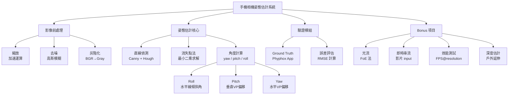
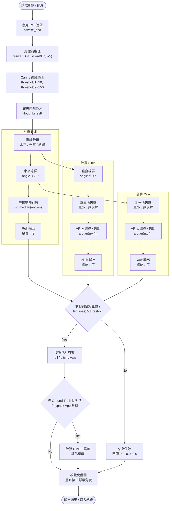

# Raspberry Pi 4 室內手機相機姿態

## 目錄

1. [需求](#需求)
2. [分析](#分析)
3. [設計](#設計)
4. [程式結構](#程式結構)
5. [驗證計畫](#驗證計畫)
6. [參數調整](#參數調整)

---

## 需求

### 功能需求

| 項目 | 說明 |
|---|---|
| 輸入 | 單張照片（`.jpg`、`.png` 等）或即時相機串流 |
| 輸出 | 估計手機相機的 yaw、pitch、roll 三軸姿態角（度） |
| 視覺化 | 畫面疊加偵測直線、消失點及角度數值 |
| 無頭模式 | 支援 `--no-display` 於無螢幕的 Raspberry Pi 上執行 |
| 影片輸出 | 可選擇將標註結果儲存為 `.mp4` |

### 規格需求

| 項目 | 規格 |
|---|---|
| 目標平台 | Raspberry Pi 4B 或同級設備 |
| 解析度 | 640 × 480 |
| 目標幀率 | 5–8 FPS（即時串流模式） |
| 依賴套件 | `opencv-python-headless`、`numpy`、`scipy` |
| 語言 | Python 3 |

### Bonus 目標

- 戶外場景仍能正確估計姿態
- 即時影片串流輸入（動態姿態估計）
- 光流法（FoE）輔助姿態估計
- 深度資訊估計
- 效能優化，達到目標 FPS@resolution

---

## 分析

### Breakdown



### 誤判來源分析

| 誤判來源 | 應對方式 |
|---|---|
| 室內雜亂線條（家具、物品邊緣） | 設定最小線段長度（`minLineLength`）過濾短線 |
| 非曼哈頓結構場景 | 角度分類容忍度（`angle_threshold`）適度放寬 |
| 影像噪點造成假邊緣 | Canny 前先做高斯模糊，提高 `threshold1` |
| 消失點落在圖像外 | 最小二乘求解加 RANSAC 排除離群線 |
| 光線不足導致邊緣偵測失敗 | 縮小解析度、調高 Canny 靈敏度 |

---
## 方法說明
 
本節依照處理流程順序，逐一說明每個使用到的演算法與函式，解釋其原理及在本專題中的用途。
 
---
 
### 1. `cv2.resize` — 影像縮放
 
**用途：** 將輸入照片縮小（預設 0.5 倍），減少後續每一步的像素運算量，讓樹莓派能在可接受時間內完成處理。
 
**原理：** 依照指定的縮放比例（`fx`、`fy`），對影像做雙線性內插（預設）重新取樣，產生較小的輸出影像。縮小後每個像素代表原圖更大的區域，細節減少但結構保留。
 
```python
img = cv2.resize(img, (0, 0), fx=0.5, fy=0.5)
```
 
---
 
### 2. `cv2.cvtColor(BGR2GRAY)` — 灰階轉換
 
**用途：** 將彩色 BGR 影像轉為單通道灰階，後續的邊緣偵測、直線偵測只需要亮度資訊，不需要顏色，轉換後可減少 2/3 的資料量。
 
**原理：** 依照人眼對顏色的感知權重做加權平均：
`Gray = 0.114·B + 0.587·G + 0.299·R`
 
```python
gray = cv2.cvtColor(img, cv2.COLOR_BGR2GRAY)
```
 
---
 
### 3. `cv2.GaussianBlur` — 高斯模糊
 
**用途：** 在 Canny 邊緣偵測之前先做平滑，抑制影像中的高頻噪點，避免噪點被誤判為邊緣，從而產生大量假直線干擾後續估計。
 
**原理：** 用一個高斯函數產生的卷積核（如 5×5）對影像做卷積，每個像素的新值是其鄰域像素的加權平均，距離中心越遠權重越小。核越大、模糊越強，但也會損失更多細節。
 
```python
blurred = cv2.GaussianBlur(gray, (5, 5), 0)
```
 
---
 
### 4. `cv2.Canny` — Canny 邊緣偵測
 
**用途：** 找出影像中亮度變化劇烈的位置（邊緣），這些邊緣正是牆壁交線、門框、地板磚縫等結構線條所在，是後續霍夫直線偵測的輸入。
 
**原理：** 分四步驟執行：
1. 計算每個像素的梯度強度與方向（Sobel 算子）
2. 非極大值抑制（Non-maximum Suppression）：只保留梯度方向上的局部極大值，讓邊緣變細
3. 雙門檻篩選：強邊緣（> `threshold2`）直接保留，弱邊緣（`threshold1`～`threshold2`）僅在與強邊緣相連時保留
4. 輸出二值化邊緣圖
```python
edges = cv2.Canny(blurred, threshold1=50, threshold2=150)
```
 
---
 
### 5. `cv2.HoughLinesP` — 機率式霍夫直線偵測
 
**用途：** 從 Canny 輸出的邊緣圖中，找出符合直線幾何的線段，作為計算消失點和姿態角的原始資料。
 
**原理：** 標準霍夫轉換將每個邊緣像素從影像空間映射到參數空間（ρ, θ），共線的像素在參數空間會匯聚到同一點，累積投票數超過門檻即視為一條直線。`HoughLinesP` 為機率式改良版，只隨機取樣部分像素，速度更快，且直接輸出線段的端點座標（`x1, y1, x2, y2`）而非無限長直線。
 
| 參數 | 意義 |
|---|---|
| `rho=1` | 距離解析度 1 像素 |
| `theta=π/180` | 角度解析度 1 度 |
| `threshold=80` | 累積票數門檻 |
| `minLineLength=60` | 線段最短長度（過濾短雜線） |
| `maxLineGap=10` | 線段間允許的最大斷口 |
 
```python
lines = cv2.HoughLinesP(edges, 1, np.pi/180, 80,
                        minLineLength=60, maxLineGap=10)
```
 
---
 
### 6. `classify_lines` — 直線分類
 
**用途：** 將偵測到的線段依照傾斜角度分成水平線、垂直線、斜線三類，分別用於計算 Roll、Pitch、Yaw，避免不同方向的線互相干擾。
 
**原理：** 對每條線段計算其傾斜角：
`angle = arctan2(y2−y1, x2−x1)`（單位：度）
- `|angle| < 20°` → 水平線（用於 Roll 和水平消失點）
- `|angle − 90°| < 20°` → 垂直線（用於垂直消失點）
- 其餘 → 斜線（暫不使用）
```python
angle = np.degrees(np.arctan2(y2 - y1, x2 - x1))
```
 
---
 
### 7. `line_to_homogeneous` — 直線齊次座標轉換
 
**用途：** 將一條由兩端點定義的線段轉換為齊次座標表示，使後續可以用向量外積（cross product）直接求兩直線的交點，數學形式簡潔且穩定。
 
**原理：** 平面上的一條直線可以用齊次向量 `l = [a, b, c]` 表示，滿足 `ax + by + c = 0`。兩點 `P1 = (x1, y1, 1)`、`P2 = (x2, y2, 1)` 的外積即為通過這兩點的直線：
`l = P1 × P2`
 
兩直線 `l1`、`l2` 的交點則為：
`P = l1 × l2`（再除以第三個分量還原為 2D 座標）
 
```python
def line_to_homogeneous(x1, y1, x2, y2):
    p1 = np.array([x1, y1, 1])
    p2 = np.array([x2, y2, 1])
    return np.cross(p1, p2)
```
 
---
 
### 8. `find_vanishing_point` — 消失點求解（最小二乘法）
 
**用途：** 給定一組同類直線（如所有水平線），找出它們在圖像中最可能的匯聚點（消失點），此點的位置直接對應相機的旋轉角度。
 
**原理：** 將每條直線轉為 `ax + by = −c` 的形式，組成超定方程組（方程數 > 未知數 2 個），用最小二乘法（`np.linalg.lstsq`）求使所有誤差平方和最小的解 `(x, y)`。當場景中的直線真的平行時，解就是理論上的消失點；有噪點時，最小二乘法給出統計上最佳的估計。
 
```python
vp, _, _, _ = np.linalg.lstsq(A, b_vec, rcond=None)
# vp = (x, y) 消失點座標
```
 
---
 
### 9. `np.median` — 中位數（Roll 角計算）
 
**用途：** 計算所有水平線傾斜角的中位數，作為 Roll 角的估計值。相較於平均數，中位數對離群值（少數方向明顯偏差的線）更具抵抗力。
 
**原理：** 將所有水平線段的傾斜角排序後取中間值。即使其中幾條線被錯誤分類或角度異常，中位數仍能反映大多數水平線的真實傾斜方向，等同於對 Roll 角做穩健估計（robust estimation）。
 
```python
roll = np.median(roll_angles)
```
 
---
 
### 10. `np.arctan2` — 反正切（角度轉換）
 
**用途：** 將消失點的像素偏移量轉換為實際的角度（度），用於計算 Pitch 和 Yaw。
 
**原理：** 根據針孔相機模型，若消失點在圖像中的偏移為 `Δ`，相機焦距為 `f`，則對應的旋轉角為：
`θ = arctan(Δ / f)`
 
`arctan2(y, x)` 相比 `arctan(y/x)` 能正確處理所有象限（包含 `x=0` 的情況），避免除以零。焦距 `f` 以影像寬度 × `focal_length_ratio`（預設 1.2）估算，若有棋盤格校正數據可替換為真實焦距。
 
```python
pitch = np.degrees(np.arctan2(vp_vertical[1] - cy, focal_length))
yaw   = np.degrees(np.arctan2(vp_horizontal[0] - cx, focal_length))
```
 
---
 
### 11. `np.sqrt(np.mean((pred - gt) ** 2))` — RMSE 誤差計算
 
**用途：** 量化程式估計的角度與 Phyphox App 記錄的真實角度之間的差距，作為系統精度的客觀指標。
 
**原理：** Root Mean Square Error（均方根誤差）= 所有樣本的預測誤差平方平均後開根號。單位與原始角度相同（度），數值越小代表估計越準確。相較於平均絕對誤差（MAE），RMSE 對大誤差懲罰更重，能突顯系統在特定場景下的失效情況。
 
```python
rmse = np.sqrt(np.mean((predicted_angles - ground_truth) ** 2))
```
 
---
 
### 12. `cv2.bitwise_and`（ROI 遮罩）
 
**用途：** 限制處理區域只在畫面的有效範圍內（ROI，Region of Interest），排除畫面邊角或不含結構線條的區域，減少雜訊來源並節省運算資源。
 
**原理：** 預先建立一張與影像同尺寸的二值遮罩（ROI 區域為白色 255，其餘為黑色 0），與原始影像做位元 AND 運算，ROI 外的像素全部歸零，等同於只保留感興趣區域。
 
```python
masked = cv2.bitwise_and(frame, frame, mask=roi_mask)
```
 
---
 
### 13. `cv2.putText` / `cv2.line`（視覺化疊圖）
 
**用途：** 將偵測到的直線、消失點位置、正十字準星及 yaw/pitch/roll 數值疊加顯示在影像上，方便即時觀察系統狀態與除錯。
 
**原理：** 直接在影像陣列上用 OpenCV 的繪圖函式寫入像素，不影響實際估計數值。`cv2.line` 畫線段，`cv2.circle` 標記消失點，`cv2.putText` 用 Hershey 字型寫入文字。
 
```python
cv2.line(img, (x1,y1), (x2,y2), (0,255,0), 1)   # 偵測直線（綠）
cv2.line(img, (cx-30,cy), (cx+30,cy), (0,0,255), 2)  # 正十字準星（紅）
cv2.putText(img, f"Y:{yaw:.1f} P:{pitch:.1f} R:{roll:.1f}",
            (10, 30), cv2.FONT_HERSHEY_SIMPLEX, 0.7, (255,255,0), 2)
```
 
---

## 設計

### 偵測流程



### 核心 API（模組介面）

| 方法 | 輸入 | 輸出 |
|---|---|---|
| `preprocess(image_path, scale)` | 圖片路徑、縮放比例 | `(img, blurred)` |
| `detect_lines(blurred_img)` | 灰階模糊影像 | `lines`（HoughLinesP 結果） |
| `classify_lines(lines, angle_threshold)` | 直線列表、角度容忍度 | `(horizontal, vertical, diagonal)` |
| `find_vanishing_point(lines)` | 直線列表 | `(x, y)` 消失點座標 |
| `estimate_pose(h_lines, v_lines, img_shape)` | 水平線、垂直線、影像尺寸 | `{"yaw": float, "pitch": float, "roll": float}` |

---

### config.json 參數說明

```jsonc
{
  "camera": {
    "width": 640,
    "height": 480,
    "fps": 15,
    "frame_skip": 2,
    "roi": [0, 0, 640, 480]
  },
  "preprocess": {
    "scale":          "縮放比例（建議 0.5，加速樹莓派運算）",
    "blur_kernel":    "高斯模糊核心大小（建議 5，奇數）"
  },
  "edge": {
    "canny_low":      "Canny 邊緣偵測下門檻（建議 50）",
    "canny_high":     "Canny 邊緣偵測上門檻（建議 150）"
  },
  "hough": {
    "rho":            "距離解析度（建議 1）",
    "theta_deg":      "角度解析度（建議 1，單位：度）",
    "threshold":      "累積門檻（建議 80，越高線越少但越可靠）",
    "min_line_length":"最小線段長度（建議 60，過濾短雜線）",
    "max_line_gap":   "最大線段間距（建議 10，允許小斷口）"
  },
  "classify": {
    "angle_threshold":"水平/垂直分類容忍角度（建議 20°）"
  },
  "pose": {
    "focal_length_ratio": "焦距估算比例（建議 1.2，乘以影像寬度）",
    "min_lines_required": "最少需要的直線數量才進行估計（建議 5）"
  }
}
```

---

## 程式結構

```
pose_estimation/
├── main.py               # 主程式入口
├── config.json           # 參數設定檔
├── preprocess.py         # 影像前處理模組
├── line_detector.py      # 直線偵測與分類模組
├── vanishing_point.py    # 消失點計算模組
├── pose_estimator.py     # 姿態角估計核心模組
├── visualizer.py         # 視覺化疊圖模組
├── validator.py          # Ground Truth 比對與 RMSE 計算
└── README.md
```

---

## 驗證計畫

| 測試項目 | 測試方法 | 預期結果 |
|---|---|---|
| 單張靜態照片 | `python main.py --source image.jpg` | 輸出 yaw / pitch / roll 數值 |
| Roll 角驗證 | 手機水平放置拍攝，Phyphox 記錄 roll ≈ 0° | 程式估計值誤差 < 3° |
| Pitch 角驗證 | 手機仰角 30° 拍攝，Phyphox 記錄 pitch ≈ 30° | 程式估計值誤差 < 5° |
| Yaw 角驗證 | 手機左右旋轉拍攝，Phyphox 記錄 yaw 值 | 程式估計值趨勢一致 |
| 直線不足場景 | 空曠場景或低紋理牆面 | 回傳 `0.0, 0.0, 0.0` 且不崩潰 |
| 低效能測試 | Raspberry Pi 4B 執行 640×480 靜態照片 | 處理時間 < 1 秒 |
| 即時串流測試（Bonus） | `python main.py --source 0` | 穩定達到 5 FPS 以上 |
| 長時間測試 | 連續執行 30 分鐘 | 不當機、記憶體不洩漏 |

---

## 參數調整

| 問題 | 調整方式 |
|---|---|
| 偵測到的直線太少 | 降低 `hough.threshold` 或降低 `hough.min_line_length` |
| 直線雜訊太多 | 提高 `hough.threshold` 或提高 `hough.min_line_length` |
| Roll 角不準 | 調整 `classify.angle_threshold`，讓水平線分類更嚴格 |
| Pitch / Yaw 偏差大 | 校正 `pose.focal_length_ratio`（用棋盤格相機校正取得真實焦距） |
| 消失點落在畫面外 | 屬正常情況，確認 `estimate_pose` 有處理畫面外消失點的 fallback |
| 邊緣偵測抓不到線 | 降低 `edge.canny_low`，或縮小 `preprocess.blur_kernel` |
| 邊緣偵測雜訊太多 | 提高 `edge.canny_low`，或加大 `preprocess.blur_kernel` |
| 樹莓派處理太慢 | 降低 `preprocess.scale`（如 0.3）或提高 `camera.frame_skip` |
| 特定場景估計失敗 | 提高 `pose.min_lines_required` 門檻，避免用太少線強行估計 |
