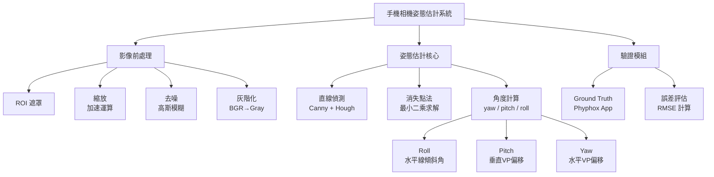
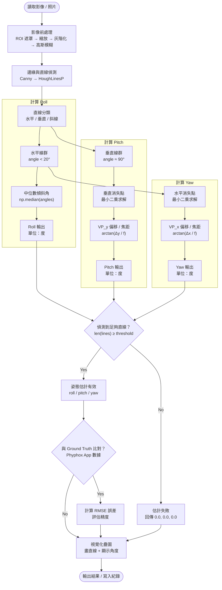

# Raspberry Pi 4 室內手機相機姿態

## 目錄

1. [需求](#需求)
2. [分析](#分析)
3. [設計](#設計)
4. [驗證計畫](#驗證計畫)
5. [參數調整](#參數調整)

---

## 需求

### 功能需求

| 項目 | 說明 |
|---|---|
| 輸入 | 單張照片（`.jpg`、`.png` 等）或即時相機串流 |
| 輸出 | 估計手機相機的 yaw、pitch、roll 三軸姿態角（度） |
| 視覺化 | 畫面疊加偵測直線、消失點及角度數值 |
| 無頭模式 | 支援 `--no-display` 於無螢幕的 Raspberry Pi 上執行 |
| 影片輸出 | 可選擇將標註結果儲存為 `.mp4` |

### 規格需求

| 項目 | 規格 |
|---|---|
| 目標平台 | Raspberry Pi 4B 或同級設備 |
| 解析度 | 640 × 480 |
| 目標幀率 | 5–8 FPS（即時串流模式） |
| 依賴套件 | `opencv-python-headless`、`numpy`、`scipy` |
| 語言 | Python 3 |

### Bonus 目標

- 戶外場景仍能正確估計姿態
- 即時影片串流輸入（動態姿態估計）
- 光流法（FoE）輔助姿態估計
- 深度資訊估計
- 效能優化，達到目標 FPS@resolution

---

## 分析

### Breakdown



### 誤判來源分析

| 誤判來源 | 應對方式 |
|---|---|
| 室內雜亂線條（家具、物品邊緣） | 設定最小線段長度（`minLineLength`）過濾短線 |
| 非曼哈頓結構場景 | 角度分類容忍度（`angle_threshold`）適度放寬 |
| 影像噪點造成假邊緣 | Canny 前先做高斯模糊，提高 `threshold1` |
| 消失點落在圖像外 | 最小二乘求解加 RANSAC 排除離群線 |
| 光線不足導致邊緣偵測失敗 | 縮小解析度、調高 Canny 靈敏度 |

---
## 方法說明
 
本節依照處理流程順序，逐一說明每個使用到的演算法與函式，解釋其原理及在本專題中的用途。
 
---
## 三軸定義


---
 
### 🔧 影像前處理
 
---
 
#### `cv2.bitwise_and` — ROI 遮罩
 
| | |
|---|---|
| **WHAT** | Region of Interest，感興趣區域遮罩，將畫面限縮於特定範圍內處理。 |
| **WHY** | 排除畫面邊角或不含結構線條的區域，減少雜訊來源並節省樹莓派的運算資源。 |
| **HOW** | 預先建立與影像同尺寸的二值遮罩（ROI 為白色 255、其餘為 0），與原圖做位元 AND，ROI 外像素全部歸零。 |
 
---
 
#### `cv2.resize` — 影像縮放
 
| | |
|---|---|
| **WHAT** | 依指定比例對影像重新取樣，產生較小的輸出影像。 |
| **WHY** | 縮小後每步運算的像素數量減少，讓樹莓派能在可接受時間內完成全流程。 |
| **HOW** | 使用雙線性內插依 `fx`、`fy` 縮放比例重新取樣，預設縮 0.5 倍，細節減少但結構保留。 |
 
---
 
#### `cv2.cvtColor(BGR2GRAY)` — 灰階轉換
 
| | |
|---|---|
| **WHAT** | 將彩色 BGR 影像轉為單通道灰階影像。 |
| **WHY** | 邊緣偵測與直線偵測只需要亮度資訊，轉換後資料量減少 2/3，加速後續計算。 |
| **HOW** | 依人眼感知權重做加權平均：`Gray = 0.114·B + 0.587·G + 0.299·R`，輸出單通道影像。 |
 
---
 
#### `cv2.GaussianBlur` — 高斯模糊
 
| | |
|---|---|
| **WHAT** | 使用高斯核對影像進行平滑化的濾波技術。 |
| **WHY** | 抑制高頻噪點，避免噪點被 Canny 誤判為邊緣，進而產生大量假直線干擾姿態估計。 |
| **HOW** | 以高斯函數產生卷積核（如 5×5），對每個像素取鄰域加權平均，距中心越遠權重越小；核越大模糊越強但細節損失越多。 |
 
---
 
### 🔍 直線偵測模組
 
---
 
#### `cv2.Canny` — Canny 邊緣偵測
 
| | |
|---|---|
| **WHAT** | 多階段邊緣偵測演算法，找出影像中亮度變化劇烈的位置。 |
| **WHY** | 牆壁交線、門框、地板磚縫等結構線條正位於邊緣處，是後續霍夫直線偵測的必要輸入。 |
| **HOW** | ① Sobel 算子計算每個像素在 X/Y 方向的梯度強度與方向，梯度大代表亮度變化大 → ② 非極大值抑制（NMS）沿梯度方向只保留局部最大值，讓邊緣細化為單像素寬 → ③ 雙門檻篩選：高於 `threshold2` 的強邊緣直接保留，介於 `threshold1` 和 `threshold2` 之間的弱邊緣只有與強邊緣相連才保留，低於 `threshold1` 直接捨棄 → ④ 輸出二值邊緣圖（邊緣為白色 255，其餘為黑色 0）。 |
 
**參數說明：**
 
| 參數 | 目前設定值 | 意義 |
|---|---|---|
| `canny_low`（`threshold1`） | 50 | 弱邊緣的下限，低於此值的像素直接排除；調低會保留更多弱邊緣，調高會過濾掉更多雜訊 |
| `canny_high`（`threshold2`） | 150 | 強邊緣的門檻，高於此值確定是邊緣；建議與 `canny_low` 維持 1:3 的比例 |
 
---
 
#### `cv2.HoughLinesP` — 機率式霍夫直線偵測
 
| | |
|---|---|
| **WHAT** | 從 Canny 輸出的邊緣圖中，找出符合直線幾何的線段，輸出每條線段的端點座標 `(x1, y1, x2, y2)`。 |
| **WHY** | 消失點計算需要大量結構線段作為輸入；`HoughLinesP` 直接輸出有限長度的線段，比標準霍夫轉換輸出無限長直線更快且更實用。 |
| **HOW** | 標準霍夫轉換將每個邊緣像素映射到參數空間（ρ, θ），共線像素匯聚到同一點累積投票，票數超過門檻即視為直線。`HoughLinesP` 為機率式改良版，只隨機取樣部分像素投票，速度更快，且直接輸出有起點和終點的線段而非無限長直線。 |
 
**參數說明：**
 
| 參數 | 目前設定值 | 意義 |
|---|---|---|
| `rho` | 1 | 參數空間的距離解析度（像素），值越小精度越高但速度越慢 |
| `theta_deg` | 1° | 參數空間的角度解析度，1° 代表每隔 1° 掃描一次 |
| `threshold` | 50 | 累積投票數門檻，一條直線至少需要這麼多像素投票才被認定；調高線條越少但越可靠，調低線條越多但雜訊也越多 |
| `min_line_length` | 40 | 線段最短長度（像素），短於此值直接捨棄；調高可過濾短雜線，調低可保留更多細短線 |
| `max_line_gap` | 20 | 同一條線上允許的最大斷口長度（像素），斷口小於此值的兩段線會合併為一條；調高可讓斷斷續續的線合併，調低則分開處理 |
 
---
 
#### `classify_lines` — 直線分類
 
| | |
|---|---|
| **WHAT** | 將偵測到的線段依傾斜角分成水平線、垂直線、斜線三類。 |
| **WHY** | 水平線用來計算 Roll 和水平消失點（Yaw），垂直線用來計算垂直消失點（Pitch），混用會互相干擾導致消失點計算偏差。 |
| **HOW** | 對每條線段計算傾斜角 `angle = arctan2(y2−y1, x2−x1)`，再依角度範圍分類：`\|angle\| < 20°` 為水平線，`\|angle − 90°\| < 20°` 為垂直線，其餘為斜線（目前不使用）。 |
 
**參數說明：**
 
| 參數 | 目前設定值 | 意義 |
|---|---|---|
| `angle_threshold` | 20° | 水平／垂直分類的容忍角度。設 20° 代表與水平軸差距在 ±20° 以內都算水平線；調小分類更嚴格但每類線條數量減少，調大分類更寬鬆但可能把斜線誤判為水平或垂直線 |
 
### 📐 姿態估計核心
 
---
 
#### `np.linalg.lstsq` — 消失點求解（最小二乘法）
 
| | |
|---|---|
| **WHAT** | 給定一組同類直線，找出它們在圖像中最可能的匯聚點（消失點）。 |
| **WHY** | 消失點的像素座標直接對應相機旋轉角度；最小二乘法在有噪點的真實場景中給出統計上最佳的估計。 |
| **HOW** | 先將每條線段的兩端點轉為齊次座標向量 `l = P1 × P2`（外積），得到 `ax + by + c = 0` 的直線表示；再將所有直線組成超定方程組 `ax + by = −c`，用最小二乘法求使誤差平方和最小的交點座標 `(x, y)`。 |
 
---
 
#### `np.median` — Roll 角計算
 
| | |
|---|---|
| **WHAT** | 取所有水平線傾斜角的中位數作為 Roll 角估計值。 |
| **WHY** | 中位數對離群值（少數方向偏差的線）具抵抗力，比平均數更能反映大多數水平線的真實傾斜方向。 |
| **HOW** | 將所有水平線傾斜角排序後取中間值，即使部分線段被錯誤分類或角度異常，結果仍穩定，屬穩健估計（robust estimation）。 |
 
---
 
#### `np.arctan2` — Pitch / Yaw 角計算
 
| | |
|---|---|
| **WHAT** | 將消失點的像素偏移量轉換為實際旋轉角度（度）。 |
| **WHY** | 針孔相機模型下，消失點偏移與相機旋轉角度成正切關係；`arctan2` 可正確處理所有象限，避免除以零。 |
| **HOW** | 依公式 `θ = arctan(Δ / f)`，其中 Δ 為消失點偏離影像中心的像素數，f 為估算焦距（影像寬 × 1.2）；有棋盤格校正數據可替換為真實焦距。 |
 
---
 
### ✅ 驗證模組
 
---
 
#### RMSE — 均方根誤差
 
| | |
|---|---|
| **WHAT** | Root Mean Square Error，量化預測角度與 Phyphox App 真實角度之間的差距。 |
| **WHY** | 提供客觀的精度指標，且對大誤差懲罰更重（相較 MAE），能突顯系統在特定場景下的失效情況。 |
| **HOW** | 計算每筆樣本的預測誤差後取平方、平均、開根號：`√(mean((pred − gt)²))`，單位與原始角度相同（度）。 |
 
---
 
### 🖥️ 視覺化模組
 
---
 
#### `cv2.line` / `cv2.putText` — 疊圖顯示
 
| | |
|---|---|
| **WHAT** | 將偵測直線、消失點、正十字準星及角度數值疊加顯示於影像上。 |
| **WHY** | 方便即時觀察系統狀態與除錯，不影響實際估計數值，僅用於人工確認結果正確性。 |
| **HOW** | `cv2.line` 畫線段（綠色為偵測直線、紅色為準星），`cv2.circle` 標記消失點，`cv2.putText` 用 Hershey 字型寫入 yaw / pitch / roll 數值。 |

---

## 設計

### 偵測流程



### 核心 API（模組介面）

| 方法 | 輸入 | 輸出 |
|---|---|---|
| `preprocess(image_path, scale)` | 圖片路徑、縮放比例 | `(img, blurred)` |
| `detect_lines(blurred_img)` | 灰階模糊影像 | `lines`（HoughLinesP 結果） |
| `classify_lines(lines, angle_threshold)` | 直線列表、角度容忍度 | `(horizontal, vertical, diagonal)` |
| `find_vanishing_point(lines)` | 直線列表 | `(x, y)` 消失點座標 |
| `estimate_pose(h_lines, v_lines, img_shape)` | 水平線、垂直線、影像尺寸 | `{"yaw": float, "pitch": float, "roll": float}` |

---

### config.json 參數說明

```jsonc
{
  "camera": {
    "width": 640,
    "height": 480,
    "fps": 15,
    "frame_skip": 2,
    "roi": null           // 改為 null，表示使用全畫面不做裁切
  },
  "preprocess": {
    "scale":          "縮放比例（建議 0.5，加速樹莓派運算）",
    "blur_kernel":    "高斯模糊核心大小（建議 5，奇數）"
  },
  "edge": {
    "canny_low":      "Canny 邊緣偵測下門檻（建議 50）",
    "canny_high":     "Canny 邊緣偵測上門檻（建議 150）"
  },
  "hough": {
    "rho":            "距離解析度（建議 1）",
    "theta_deg":      "角度解析度（建議 1，單位：度）",
    "threshold":      "累積門檻（建議 80，越高線越少但越可靠）",
    "min_line_length":"最小線段長度（建議 60，過濾短雜線）",
    "max_line_gap":   "最大線段間距（建議 10，允許小斷口）"
  },
  "classify": {
    "angle_threshold":"水平/垂直分類容忍角度（從建議 20° 放寬至 35°，因為場景 Yaw 角較大時結構線偏離水平較多，需要更寬的窗口才能抓到足夠的線條）"
  },
  "pose": {
    "focal_length_px": 681.9,           // 新增：由棋盤格相機校正取得的真實焦距（像素），設定此值後 focal_length_ratio 會被忽略
    "focal_length_ratio": "焦距估算比例（從建議 1.2 調整為 1.076，由實測誤差校正；僅在未設定 focal_length_px 時使用）",
    "calibration_file": "20260610.npz", // 新增：相機校正檔路徑（含 mtx / dist），由 15 張棋盤格照片校正產生
    "min_lines_required": "最少需要的直線數量才進行估計（建議 5）"
  }
}
```

---


## 驗證計畫

| 測試項目 | 測試方法 | 預期結果 |
|---|---|---|
| 單張靜態照片 | `python main.py --source image.jpg` | 輸出 yaw / pitch / roll 數值 |
| Roll 角驗證 | 手機水平放置拍攝，Phyphox 記錄 roll ≈ 0° | 程式估計值誤差 < 3° |
| Pitch 角驗證 | 手機仰角 30° 拍攝，Phyphox 記錄 pitch ≈ 30° | 程式估計值誤差 < 5° |
| Yaw 角驗證 | 手機左右旋轉拍攝，Phyphox 記錄 yaw 值 | 程式估計值趨勢一致 |
| 直線不足場景 | 空曠場景或低紋理牆面 | 回傳 `0.0, 0.0, 0.0` 且不崩潰 |
| 低效能測試 | Raspberry Pi 4B 執行 640×480 靜態照片 | 處理時間 < 1 秒 |
| 即時串流測試（Bonus） | `python main.py --source 0` | 穩定達到 5 FPS 以上 |
| 長時間測試 | 連續執行 30 分鐘 | 不當機、記憶體不洩漏 |

---

## 誤差曲線
### Yaw


| GT Yaw | 程式輸出 | 誤差 | 備註 |
|---|---|---|---|
| -90° | -1° | +89° | ❌ 失效 |
| -60° | 30° | +90° | ❌ 失效 |
| -45° | -40° | +5° | ✅ |
| -30° | -30° | 0° | ✅ |
| -15° | -17° | -2° | ✅ |
| 0° | 4° | +4° | ✅ |
| 15° | 16° | +1° | ✅ |
| 30° | 31° | +1° | ✅ |
| 45° | 42° | -3° | ✅ |
| 60° | -31° | -91° | ❌ 失效 |
| 90° | -3° | -93° | ❌ 失效 |
| GT Yaw | 程式輸出 | 誤差 | 備註 |


### Pitch


| GT Pitch | 程式輸出 | 誤差 | 備註 |
|---|---|---|---|
| -45° | 67° | +112° | ❌ 失效 |
| -30° | 53° | +83° | ❌ 失效 |
| -15° | 33° | +48° | ❌ 失效 |
| 0° | 6° | +6° | ✅ |
| +15° | 78° | +63° | ❌ 失效 |
| +30° | 47° | +17° | ⚠️ 偏差偏大 |
| +45° | 11° | -34° | ❌ 失效 |


## 參數調整

| 問題 | 調整方式 |
|---|---|
| 偵測到的直線太少 | 降低 `hough.threshold` 或降低 `hough.min_line_length` |
| 直線雜訊太多 | 提高 `hough.threshold` 或提高 `hough.min_line_length` |
| Roll 角不準 | 調整 `classify.angle_threshold`，讓水平線分類更嚴格 |
| Pitch / Yaw 偏差大 | 校正 `pose.focal_length_ratio`（用棋盤格相機校正取得真實焦距） |
| 消失點落在畫面外 | 屬正常情況，確認 `estimate_pose` 有處理畫面外消失點的 fallback |
| 邊緣偵測抓不到線 | 降低 `edge.canny_low`，或縮小 `preprocess.blur_kernel` |
| 邊緣偵測雜訊太多 | 提高 `edge.canny_low`，或加大 `preprocess.blur_kernel` |
| 樹莓派處理太慢 | 降低 `preprocess.scale`（如 0.3）或提高 `camera.frame_skip` |
| 特定場景估計失敗 | 提高 `pose.min_lines_required` 門檻，避免用太少線強行估計 |
